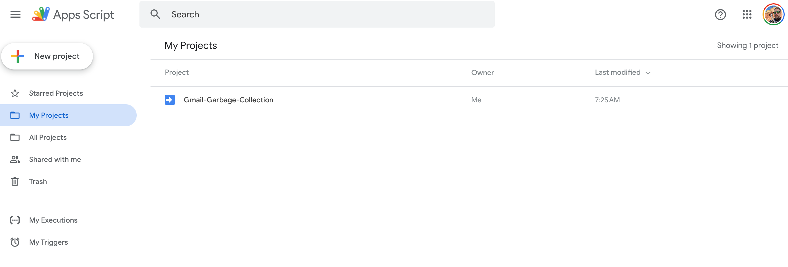
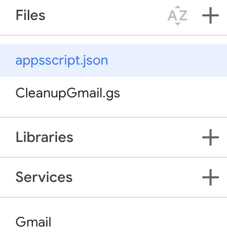
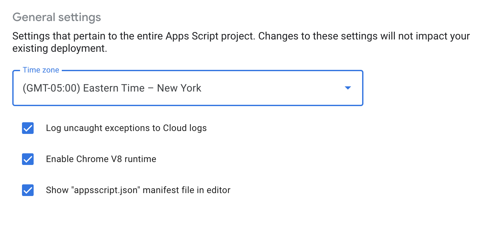
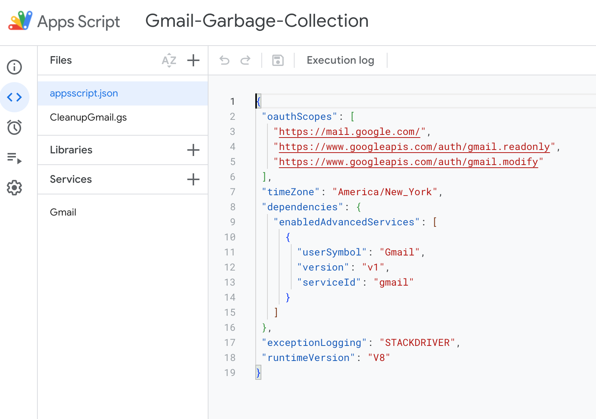
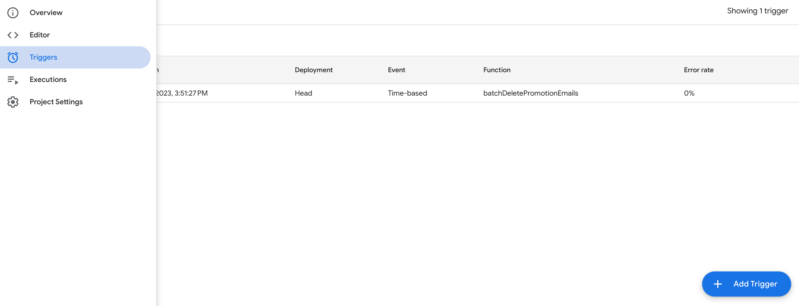
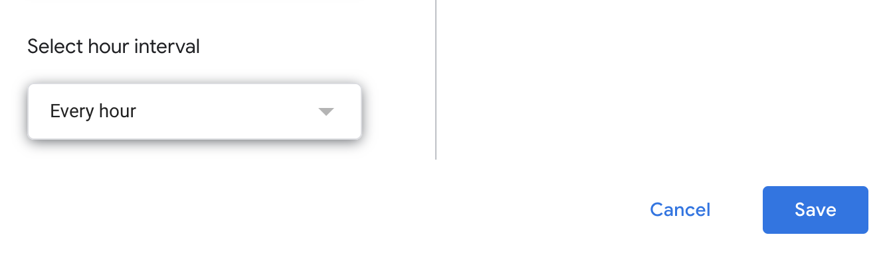
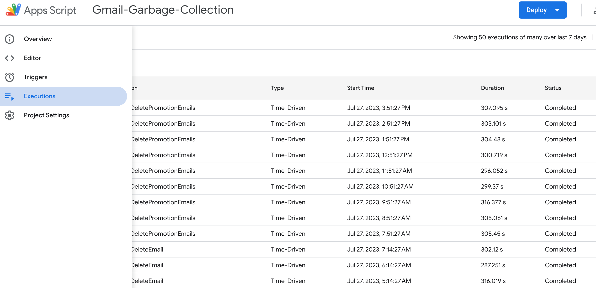
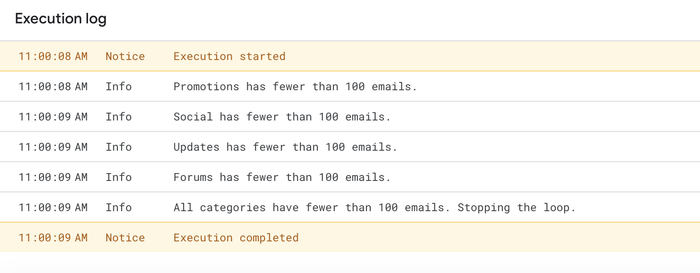

# Got Junkmail?

Cleanup your Gmail using AppScripts.  This handy little tool will
periodically clean up Gmail categories.

If you have built up a lot of email subscriptions, and are not periodically
unsubscribing or filtering, then you may have a good amount of junk email.

[Google App Scripts](https://script.google.com/) can help keep your 
tabs clean over time.  This simple script will batch cleanup 500 emails per 
hour, through four categories.

- Promotions
- Social
- Updates
- Forums

### Get started

Sign up for [Google App Scripts](https://script.google.com/) workspace.



Click on New Project once you are signed in.

### Enable Gmail services

Enable Gmail services for the AppScript.



### Project Settings

Make the manifest visible and edit the manifest. 

The Apps Script editor hides manifest files by default in order to protect your Apps Script project settings. Follow these steps to make a hidden project manifest visible in the Apps Script editor:

- Open the script project in the Apps Script editor.
- Click Project Settings settings.
- Select the Show "appsscript.json" manifest file in editor checkbox.



Copy in ```manifest.json```

The appscript.json sets the scope for oauth.  You will be prompted for enabling
the access to your personal account so that the script can run using your gmail
credentials.  Go ahead and setup your account.

### Copy the script

In your new project add the script and copy in ```CleanupGmail.gs```



### Setup the schedule

The main constraint is the number of times you can call ```batchDeleteEmail``` in a 24 hour period.

The threshold seems to be [around ~10K](https://stackoverflow.com/questions/10619919/service-invoked-too-many-times-for-one-day-gmail-read).  The timer is set at 1x every hour for deleting a batch of emails.
Navigate to Triggers:



Add a new Trigger and select ```batchDeleteEmail``` to run on an hourly timer.  The categories are rotated through in the script here:

```
  // If there is no currentCategory or its the last category, reset to the first category
  if (!currentCategory || categories.indexOf(currentCategory) === categories.length - 1) {
    currentCategory = categories[0];
  } else {
    // Otherwise, move to the next category in the list
    var currentIndex = categories.indexOf(currentCategory);
    currentCategory = categories[currentIndex + 1];
  }
```

You can modify the variable for different categories as needed.

```var categories = ['Promotions', 'Social', 'Updates', 'Forums'];```

Important: Anything more aggressive than batchSize=100 will cause the script to fail within a 24hour window.

```var batchSize = 100;```

### Edit the trigger

Add a trigger for ```batchDeleteEmail``` to run hourly under triggers and save it.




### Watch it run and periodically check it

Navigate over to executions to see the execution log.



If all categories are below the 100 email threshold then stop processing.


