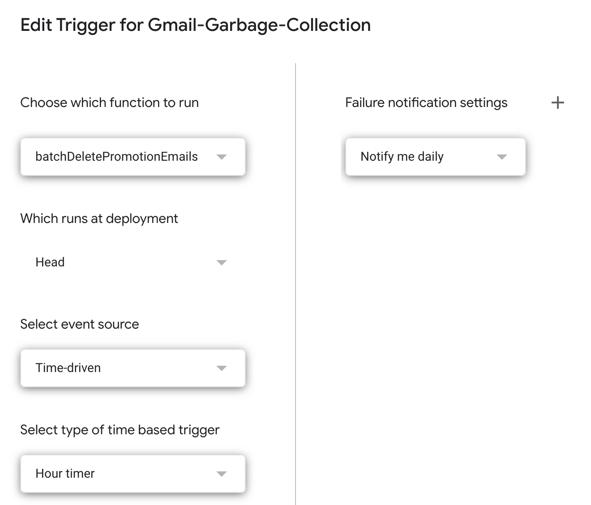

# Cleanup your Gmail

The goal of this script is to cleanup your personal Gmail using
[Google App Scripts](https://script.google.com/)

It's based on a few pre-existing gists on the topic.

[batch-delete-gmail-emails](https://gist.github.com/gene1wood/0f455239490e5342fa49?permalink_comment_id=3644)

There are a few added screenshots of the console for clarifying steps.

This script will cleanup approximately 500 emails per hour/12K emails per day (at minimum).

### Start

Sign up for [Google App Scripts](https://script.google.com/) workspace.

It's a nice looking console experience.


Click on New Project once you are signed in through your personal account.

### Copy the script

In the new empty project, populate it with the two files:

```CleanupGmail.gs and appscript.json```


The appscript.json sets the scope for oauth.  You will be prompted for enabling
the access to your personal account so that the script can run using your gmail
credentials.

### Setup the schedule

The main constraints are the number of times you can call ```batchDeleteEmail``` against Gmail per 24 hour period.

The threshold seems to be [around ~10K](https://stackoverflow.com/questions/10619919/service-invoked-too-many-times-for-one-day-gmail-read)

The timer we will set is 1x every hour for deleting a batch of emails.

It's possible to [batch multiple categories](https://stackoverflow.com/questions/21509254/get-gmail-categories)

Navigate to Triggers


Add a new Trigger and select batchDeletePromotionsEmail to run on an hourly timer.

We set the scope of the email through the function here:
```var promotion_threads = GmailApp.search('category:promotions older_than:10d')```

You can modify the categories as needed. e.g. Social.

Anything more aggressive will cause the script to fail within the 24hour timer.



### Watch it run

Navigate over to executions to see the execution log.


### Change the category and iterate batches

Both the Promotion and Forums seem to take up a lot of junk mail space.

It's possible to [iterate through multiple categories](https://stackoverflow.com/questions/21509254/get-gmail-categories)

I attempted to iterate through categories and batch delete 
each on a timer, however that quickly ran into the API limits calling batchDeleteEmail against my
personal account.

Instead, I just let one category deletion run it's course and just added another.


