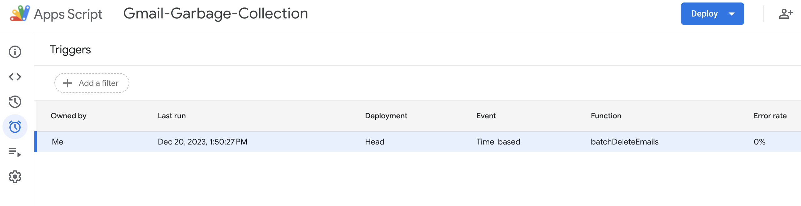

# Gmail Garbage Collection

Cleanup your personal Gmail using a [Google App Scripts](https://script.google.com).


## About

This AppScript will leave you with no more than 100 Social, Updates, Promotions, and Forums emails.

If you have a lot of email subscriptions and other updates and you are not periodically
unsubscribing, manually deleting, or filtering then you probably have good amount of junk email.

You may even have to pay to [add storage](https://support.google.com/drive/answer/2375123?hl=en&co=GENIE.Platform%3DDesktop).

## Step by Step Guide

### Get started

Sign up for [Google App Scripts](https://script.google.com/) workspace.


Click on New Project once you are signed in.

### Project Settings

#### Project Setting 1

Enable Gmail services for the AppScript.

 

#### Project Setting 2

Copy in the ```appsscript.json``` to set the OAuth scope.

The Apps Script editor hides manifest files by default in order to protect your 
Apps Script project settings. Follow these steps to make a hidden project manifest 
visible in the Apps Script editor:

- Open the script project in the Apps Script editor.
- Click Project Settings settings.
- Select the Show "appsscript.json" manifest file in editor checkbox.

You will be prompted to access to your personal account so that the script
can run using your gmail credentials.


#### Project Setting 3

Edit the script properties and add the ```currentCategory``` property setting a
starting point.


### Enter Editor mode

In your new project add the script and copy in ```CleanupGmail.gs``` in editor mode.


### Setup the schedule

The main constraint is the number of times you can call ```batchDeleteEmail``` in a 24 hour period.

The threshold seems to be [around ~10K](https://stackoverflow.com/questions/10619919/service-invoked-too-many-times-for-one-day-gmail-read).  The timer is set at 1x every hour for deleting a batch of emails.
Navigate to Triggers:



Add a new Trigger and select ```batchDeleteEmail``` to run on an hourly timer.  The categories are rotated through in the script here:

```
  // If there is no currentCategory or its the last category, reset to the first category
  if (!currentCategory || categories.indexOf(currentCategory) === categories.length - 1) {
    currentCategory = categories[0];
  } else {
    // Otherwise, move to the next category in the list
    var currentIndex = categories.indexOf(currentCategory);
    currentCategory = categories[currentIndex + 1];
  }
```

You can modify the variable for different categories as needed.

```var categories = ['Promotions', 'Social', 'Updates', 'Forums'];```

Important: Anything more aggressive than batchSize=100 will cause the script to fail within a 24hour window.

```var batchSize = 100;```

### Edit the trigger

Add a trigger for ```batchDeleteEmail``` to run hourly under triggers and save it.


### Watch it run and periodically check it

Navigate over to executions to see the execution log.


If all categories are below the 100 email threshold then stop processing.


